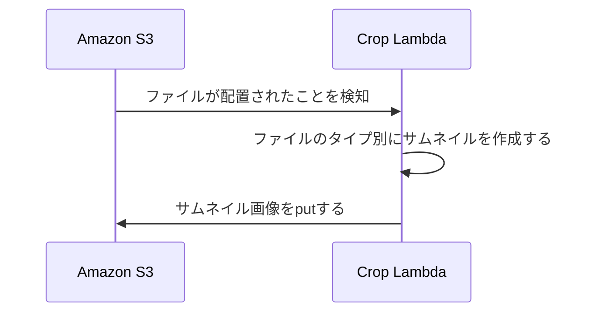

# gomb
あらゆるメディアからサムネイルを作る

```mermaid
sequenceDiagram
    participant s3 as Amazon S3
    participant crop as Crop Lambda

s3->>crop: ファイルが配置されたことを検知
crop->>crop: ファイルのタイプ別にサムネイルを作成する
crop->>s3: サムネイル画像をputする
```
