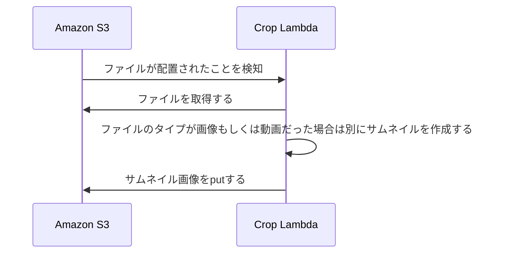

# gomb
あらゆるメディアからサムネイルを作る

```mermaid
sequenceDiagram
    participant s3 as Amazon S3
    participant crop as Crop Lambda

s3->>crop: ファイルが配置されたことを検知
crop->>s3: ファイルを取得する
crop->>crop: ファイルのタイプが画像もしくは動画だった場合は別にサムネイルを作成する
crop->>s3: サムネイル画像をputする
```
